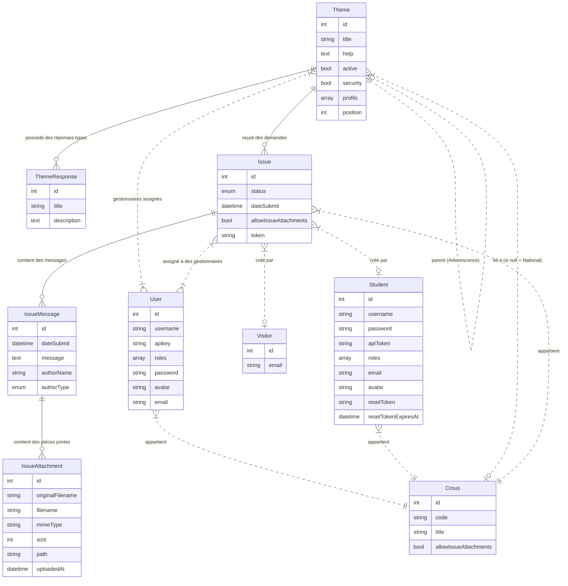

# Gate

## POC

POC disponible sur = [https://msepoc.cadol.es](https://msepoc.cadol.es)

Pour faciliter la recette du POC, différents profils utilisateurs ont été pré-configurés.
**Mot de passe unique** : `changeme`

## Installation locale

### Prérequis
- Docker & Docker Compose

### Démarrage

```bash
# Démarrer tous les services
docker compose up -d

# Initialiser l'application
docker exec gate php bin/console app:init

# Synchroniser LDAP
docker exec gate php bin/console app:ldap:sync

# Vérifier la synchronisation LDAP
docker exec gate php bin/console app:ldap:verify
```

### Services

| Service | URL | Description |
|---------|-----|-------------|
| Gate App | http://localhost:8019 | Application principale |
| GLAuth (LDAP) | ldap://localhost:389 | Annuaire LDAP |
| Adminer | http://localhost:6019 | Administration BDD |
| MailHog | http://localhost:8025 | Catch-all email |

## Configuration GLAuth (LDAP)

GLAuth est un serveur LDAP léger qui expose les données User/Group de l'application via le plugin MySQL.

### Fichier de configuration

Le fichier `volume/glauth/config.cfg` doit être créé manuellement avec le contenu suivant :

```toml
[backend]
  datastore = "plugin"
  plugin = "/app/mysql.so"
  pluginhandler = "NewMySQLHandler"
  database = "user:changeme@tcp(mariadb:3306)/gate"
  baseDN = "dc=ninegate,dc=local"

[ldap]
  enabled = true
  listen = "0.0.0.0:3893"
  tls = false

[ldaps]
  enabled = false

[behaviors]
  IgnoreCapabilities = true
  LimitFailedBinds = true
  NumberOfFailedBinds = 3
  PeriodOfFailedBinds = 10
  BlockFailedBindsFor = 60
  PruneSourceTableEvery = 600
  PruneSourcesOlderThan = 600
```

### Vues SQL

GLAuth utilise des vues SQL pour mapper les données de l'application vers le schéma LDAP. Ces vues sont créées automatiquement via `app:init` ou `app:ldap:sync`.

### Commandes utiles

```bash
# Synchroniser LDAP après modification des users/groups
docker exec gate php bin/console app:ldap:sync

# Vérifier la synchronisation LDAP
docker exec gate php bin/console app:ldap:verify

# Vérifier et nettoyer les entrées LDAP orphelines
docker exec gate php bin/console app:ldap:verify --fix
```

| Identifiant | Rôle | Crous | Description |
| :--- | :--- | :--- | :--- |
| `admin` | **ROLE_ADMIN** | - | Administrateur global. |
| `gcnous` | **ROLE_GCNOUS** | - | Gestionnaire National. |
| `ccnous` | **ROLE_CCNOUS** | - | Consultant National. |
| `gcrousTOU` | **ROLE_GCROUS** | TOU | Gestionnaire Toulouse. |
| `cgrousTOU` | **ROLE_CCROUS** | TOU | Consultant Toulouse. |
| `gcrousBFC` | **ROLE_GCROUS** | BFC | Gestionnaire Bourgogne Franche-Comté. |
| `cgrousBFC` | **ROLE_CCROUS** | BFC | Consultant Bourgogne Franche-Comté. |
| `gcrousLIM` | **ROLE_GCROUS** | LIM | Gestionnaire Limoges. |
| `cgrousLIM` | **ROLE_CCROUS** | LIM | Consultant Limoges. |

## Modèle Conceptuel de Données (MCD)

L'application gère une arborescence de thèmes (sujets) hiérarchisés, potentiellement liés à une entité administrative (Crous) et à des utilisateurs gestionnaires. Les utilisateurs externes (Étudiants, Visiteurs) peuvent créer des demandes (Issues) associées à ces thèmes.



## Description Fonctionnelle

L'application assure la gestion du référentiel des motifs de contact (Thèmes) du système de messagerie (MSE). Elle permet de structurer les demandes des utilisateurs via une classification hiérarchique et contextuelle.

### 1. Gestion des Thèmes et Réponses Types

#### 1.1 Arborescence des Thèmes

Les thèmes sont organisés selon une structure en arbre pouvant aller jusqu'à 4 niveaux de profondeur.

* **Navigation & Filtrage** : Visualisation par niveau et filtre sur les éléments actifs/inactifs.
* **Réorganisation Dynamique** : Interface "Glisser-Déposer" (Drag & Drop) permettant de modifier facilement l'ordre et la hiérarchie des thèmes (`ThemeController::move`).
* **Configuration** : Chaque thème dispose d'attributs de visibilité (Actif/Inactif), de contextes de sécurité (Profils autorisés : Étudiant, Visiteur) et d'aide contextuelle.

#### 1.2 Périmètres et Responsabilités (National / Crous)

Le système distingue deux niveaux de gouvernance :

* **National** : Gestion des thèmes transverses communs à l'ensemble du réseau.
* **Local (Crous)** : Chaque Crous peut gérer ses propres déclinaisons ou spécificités locales.
* **Cloisonnement** : Un système de permissions (Voters) garantit qu'un gestionnaire local ne peut modifier que les thèmes rattachés à son Crous, tandis que le niveau National supervise l'ensemble.

#### 1.3 Base de Connaissance (Réponses Types)

Pour faciliter le traitement des demandes, des Réponses Types peuvent être associées à chaque thème (`ThemeResponseController`). Elles fournissent aux gestionnaires des modèles de réponse standardisés, assurant ainsi une cohérence dans la communication.

#### 1.4 Attribution et Sécurité

* **Profilage** : Restriction de la visibilité d'un thème selon le profil de l'utilisateur connecté (ex: réservé aux étudiants).
* **Assignation** : Possibilité d'attribuer spécifiquement un thème à une liste de gestionnaires/consultants du Crous concerné, restreignant ainsi son traitement aux personnes compétentes (uniquement pour les thèmes liés à un Crous local). Si aucun gestionnaire n'est assigné, tous les gestionnaires/consultants de ce Crous pourront voir les messages liés à ce thème.

#### 1.5 Autorisation de Pièces Jointes

Il est possible pour un étudiant/visiteur d'associer une pièce jointe lors de la création de son message si l'une des conditions suivantes est remplie :
* Le thème lié au message est flagué comme étant de type "sécurité" (`security = true`)
* Le Crous associé au message autorise les pièces jointes (`allowIssueAttachments = true`)

#### 1.6 Règles de Gestion et Validation

L'intégrité des données est assurée par des validateurs spécifiques appliqués à l'entité `Theme` :

| Règle | Description |
| :--- | :--- |
| **MaxDepth** | La profondeur de l'arborescence ne peut excéder **4 niveaux**. |
| **NoCrousRoot** | Un thème racine (Niveau 1) ne peut pas être rattaché à un Crous (il doit être National). |
| **NoCircularReference** | Un thème ne peut pas être son propre parent (direct ou indirect). |
| **CrousConsistency** | Cohérence hiérarchique : un sous-thème local ne peut être créé que sous un parent National ou du même Crous. |
| **Profils** | Au moins un profil cible (Étudiant, Visiteur) doit être sélectionné. |

#### 1.7 Matrice des Permissions (ACL) - Thèmes

Les actions autorisées sont déterminées par le rôle de l'utilisateur et le contexte du thème (Voter).

| Rôle | Voir Arborescence | Créer Racine (Niv 1) | Créer Sous-thème (Niv 2-4) | Modifier / Supprimer |
| :--- | :---: | :---: | :---: | :---: |
| **Admin PVE** | ✅<br>Tout | ✅ | ✅ | ✅ |
| **Gestionnaire CNOUS** | ✅<br>Tout | ❌ | ✅ | ✅<br>(Sauf niveau 1) |
| **Consultant CNOUS** | ✅<br>Tout | ❌ | ❌ | ❌ |
| **Gestionnaire CROUS** | ✅<br>(National + Son Crous) | ❌ | ✅<br>(Si parent Nat. ou son Crous) | ✅<br>(Uniquement ses thèmes) |
| **Consultant CROUS** | ✅<br>(National + Son Crous) | ✅<br>(National + Son Crous) | ❌ | ❌ | ❌ |

### 2. Gestion des Messages (Interface Gestionnaire/Consultant)

L'interface interne permet aux gestionnaires et consultants de visualiser et traiter les demandes (Issues) adressées au Crous.

#### 2.1 Liste des Demandes

* **Console de visualisation** (`IssueController::indexInternal`) : Liste de toutes les demandes avec filtrage par :
  * Statut (À répondre, Répondu, Émis)
  * Date du dernier message (début/fin)
  * Thème (hiérarchique, avec tous les sous-thèmes)
  * ID Étudiant
  * Email
* **Filtrage par périmètre** :
  * Admin/CNOUS : voit l'ensemble des demandes, peut filtrer par CROUS
  * Gestionnaire/Consultant Crous : voit les demandes de son Crous (National + local), pas de filtre CROUS (auto-filtré)
  * Les thèmes affichés sont filtrés selon les droits (National ou son CROUS, et affectation utilisateur le cas échéant)

#### 2.2 Colonnes affichées

| Colonne | Description |
|---------|-------------|
| ID | Lien vers la vue détaillée |
| Statut | À répondre / Répondu / Émis |
| CROUS | Code CROUS |
| Niveaux Thème | Chemin hiérarchique du thème (ex: Transport > Train > TGV) |
| Email | Email de l'étudiant ou du visiteur |
| ID Étudiant | ID de l'étudiant (si applicable) |
| Dernier message | Date de création du dernier message |
| Nb messages | Nombre de messages dans la conversation |

#### 2.3 Traitement des Demandes

* **Consultation détaillée** (`IssueController::viewInternal`) : Visualisation complète d'une demande avec :
  * Historique des messages chronologiques
  * Informations sur le demandeur (Étudiant ou Visiteur)
  * Thème associé et chemin hiérarchique
  * Pièces jointes
* **Réponses types** : Accès rapide aux réponses pré-enregistrées pour le thème concerné
* **Réponse au demandeur** : Formulaire de réponse avec :
  * Zone de texte pour le message
  * Upload de pièces jointes (3 maximum)
  * Bouton rapide pour insérer un lien vers la page "Mot de passe oublié"
  * Option pour autoriser ou interdire au demandeur de répondre avec des pièces jointes
  * Choix du statut après réponse :
    * **Envoyer et passer en Émis** : Le demandeur pourra répondre à la suite de cette réponse
    * **Envoyer et marquer comme Répondu** : Le demandeur ne pourra plus répondre (conversation close)
* **Transfert de demande** (`IssueController::transferIssue`) : Possibilité de transférer une demande vers un autre Crous avec changement de thème

* **Notification par email** : À chaque envoi de réponse par le gestionnaire/consultant, un email est automatiquement envoyé au demandeur (étudiant ou visiteur) contenant :
  * Le numéro de demande et le token
  * Le CROUS et le thème
  * Le statut actuel
  * L'historique complet des échanges (messages textuels uniquement, sans les pièces jointes)
  * Un lien pour consulter et répondre à la demande

#### 2.4 Création de Demandes (Admin/Gestionnaire/Consultant)

* **Création externe** (`IssueController::newIssueInternal`) : Possibilité pour les profils suivants de créer une demande au nom d'un étudiant via la console des usagers :
  * Admin
  * Gestionnaire CNOUS
  * Consultant CNOUS
  * Gestionnaire CROUS
  * Consultant CROUS
  * Statut initial : Émis

### 3. Gestion des Messages (Interface Étudiant/Visiteur)

L'interface externe permet aux utilisateurs (Étudiants identifiés ou Visiteurs anonymes) de créer et suivre leurs demandes.

#### 3.1 Création d'une Demande

* **Formulaire de contact** (`IssueController::newIssue`) :
  * Sélection du Crous (pré-sélectionné pour les étudiants connectés)
  * Navigation dans l'arborescence des thèmes (API : `/api/themes/level1`, `/api/themes/children`)
  * Le thème doit être au moins de niveau 3
  * Message initial obligatoire
  * Upload de pièces jointes (3 maximum, selon configuration du CROUS ou thème de sécurité)
* **Confirmation** : Après soumission, un email de confirmation est envoyé contenant :
  * Le numéro de demande et le token
  * Le CROUS et le thème (chemin hiérarchique)
  * La date de soumission
  * Le statut initial
  * Le message initial
  * Le nombre de pièces jointes (si présentes)
  * Un lien pour consulter et suivre la demande

#### 3.2 Suivi des Demandes (Étudiant)

* **Liste des demandes** (`IssueController::studentIssueIndex`) : Visualisation de l'historique des demandes soumises par l'étudiant connecté
* **Consultation** (`IssueController::studentIssueView`) :
  * Historique des messages
  * Statut actuel de la demande
  * Pièces jointes
* **Réponse** : Possibilité de répondre uniquement quand le statut est "Émis" (en attente de réponse client)

#### 3.3 Suivi des Demandes (Visiteur)

* **Accès par token** : Le visiteur accède à sa demande via le lien contenu dans l'email de confirmation ou de réponse. L'URL doit contenir le token unique de la demande.
* **Vérification d'identité** : Pour accéder à la demande, le visiteur doit saisir son adresse email. Celle-ci doit correspondre à l'email du visiteur associé à la demande (authentification sans mot de passe).
* **Consultation** (`IssueController::visitorIssueDetail`) : Même fonctionnalités que pour les étudiants (historique des messages, statut, pièces jointes)
* **Réponse** : Possible uniquement quand le statut est "Émis"


## API Platform (Perspectives d'évolution)

### Qu'est-ce que API Platform ?

**API Platform** est un framework PHP open-source built on top de Symfony, conçu pour créer rapidement des APIs REST et GraphQL de qualité professionnelle. Il permet de transformer des entités Doctrine en ressources API exposées automatiquement avec :

* **Documentation automatique** : Génère une documentation OpenAPI/Swagger interactive
* **Validation des données** : Utilise les contraintes de validation Symfony
* **Filtrage et pagination** : Système de filtres intégrés (recherche, tri, pagination)
* **Authentification** : Support natif de JWT, OAuth, etc.
* **Formatage JSON-LD/HAL** : Standards du web sémantique

### Application au projet MSE

L'implémentation d'API Platform dans ce projet pourrait représenter une étape majeure dans l'évolution de l'architecture de l'application, en particulier pour répondre aux besoins croissants de découplage entre le front-end et le back-end.

#### Découplage front/back

Actualmente, l'application MSE utilise une approche monolithique où le front-end (templates Twig) est étroitement intégré au back-end (contrôleurs Symfony). Bien que cette approche soit simple et efficace pour un projet de taille modeste, elle présente plusieurs limitations :

* **Difficulté à maintenir** : Toute modification de l'interface utilisateur nécessite une intervention sur le code serveur
* **Impossibilité de partager les ressources** : L'application mobile CROUS ou d'autres services ne peuvent pas réutiliser facilement les fonctionnalités existantes
* **Technologies figées** : Le choix de Twig impose de facto l'utilisation de PHP pour le front-end

En exposant une API REST via API Platform, cela nous permettrait de :

* **Séparer les préoccupations** : Le front-end pourrait être développé indépendamment (React, Vue.js, mobile natif, etc.) en consommant uniquement l'API
* **Réutiliser les ressources** : L'API pourrait être consommée par l'application mobile CROUS, des services internes (CRM, outils de ticketing), ou même des partenaires externes
* **Évolutivité** : L'architecture microservices devient possible à terme, avec des équipes pouvant travailler de manière indépendante sur différentes briques

#### Mise en place progressive

L'introduction d'API Platform ne nécessite pas de refondre l'existant. Une approche progressive est recommandée :

1. **Exposition des ressources existantes** : Les entités `Issue` et `IssueMessage` pourraient être exposées via API Platform avec un minimum de configuration
2. **Ajout de la sécurité** : Intégration avec le système d'authentification existant (JWT ou token OAuth)
3. **Création de nouveaux endpoints** : Pour les fonctionnalités non encore présentes dans l'API
4. **Migration progressive du front** : Les nouveaux écrans pourraient être développés en consommant l'API, tandis que les écrans existants continueraient à utiliser les contrôleurs Twig

#### Entités à exposer

Les principales entités à exposer seraient :

| Entité | Description | Opérations CRUD |
|--------|-------------|-----------------|
| Issue | Demande/Signalement | Créer, Lire, Mettre à jour |
| IssueMessage | Messages d'une demande | Créer, Lire |
| Theme | Thèmes hiérarchiques | Lire |
| ThemeResponse | Réponses types | Lire |
| Crous | Établissements CROUS | Lire |

#### Avantages concrets

* **Pour les étudiants** : Une application mobile performante avec une expérience utilisateur moderne
* **Pour les gestionnaires** : Possibilité de développer des outils de gestion dédiés (tableaux de bord avancés, statistiques)
* **Pour les équipes techniques** : Maintenance simplifiée, tests unitaires plus ciblés, déploiement indépendant
* **Pour le CROUS** : Flexibilité pour intégrer le système de messages avec d'autres outils (CRM, ERP, etc.)